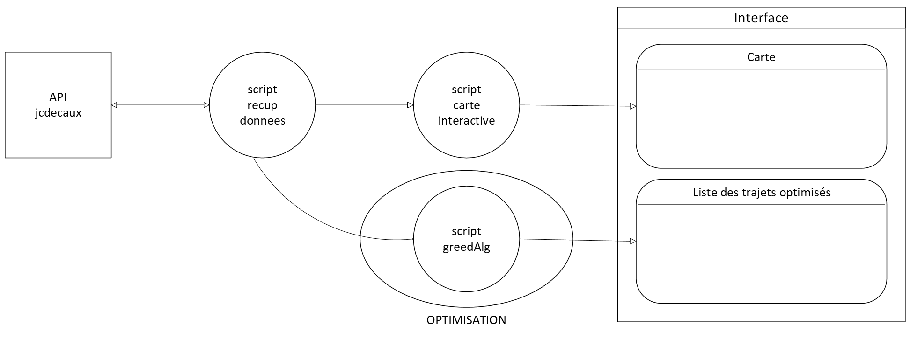
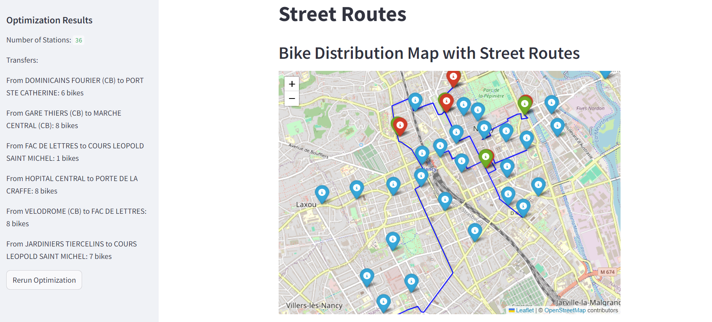

# Rééquilibrage des stations de vélos partagés

## Objectif
L'objectif de ce projet est de  développer une interface interactive pour visualiser et optimiser l'utilisation des stations de vélos partagés à Nancy, en intégrant des données en temps réel et en proposant un système de récompenses pour encourager le rééquilibrage des vélos aux stations par les utilisateurs.

## Modélisation de la solution

##  Pré-requis
* Python 3.12.6

## Instructions
* Importer les librairies contenues dans [requirements](requirements.txt)
* Dans un terminal, exécuter le fichier appBike.py grâce à la commande :
> streamlit run InterpriseApp/appBike.py
* Ctrl+click sur le premier lien obtenu dans le terminal

## Résultat

## Documentation
* [Formulation du problème](problem_formulation.pdf)
* [Explication de l'algorythme d'optimisation](codeOptimizationExplanation.pdf)
* [Dictionnaire des termes et fonction pour l'optimisation](dictionary.pdf)
  
## Auteurs
* Darya Filatova (@delnouty)
* Léa Lorin (@llorin-capi)
* Théo Virbel (@Theo-virbel)
* Serge Pfeiffer (@DahliaNoir71)
